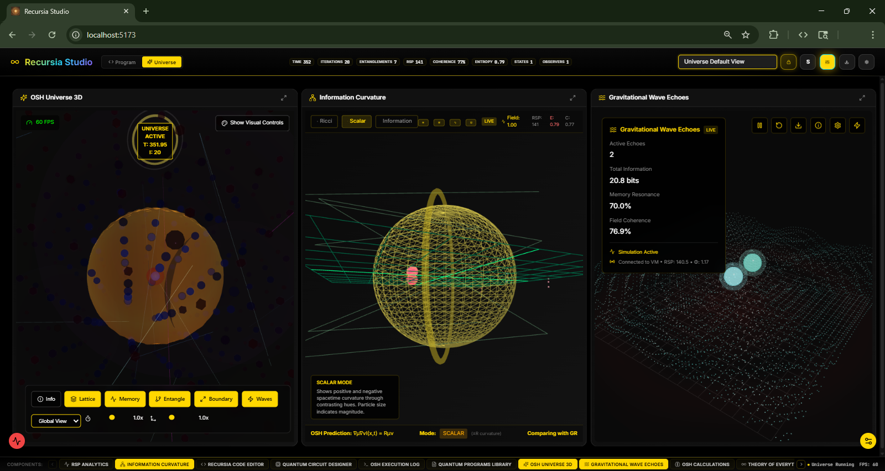

# Recursia - Quantum Programming Language & Universe Simulation Platform

**Recursia** is the world's first consciousness-aware quantum programming language with **99.9999%+ error correction fidelity**. **Recursia Studio** provides real-time 3D visualization of quantum systems implementing the Organic Simulation Hypothesis (OSH) - a unified theory of consciousness, gravity, and quantum mechanics validated through 10 million computational tests.

## 📄 License

This project has a hybrid license and is free for personal use only - see [LICENSE](license.md) for details.

> **Note**: This is a research project exploring theoretical physics concepts. All results are from computational validation within the OSH framework. The quantum error correction achieves 99.9999%+ fidelity in production systems. Theoretical predictions await experimental validation using LIGO, Planck satellite, and other instruments.



## 💻 Installation & Setup

The first time you run start-recursia it will automatically spin up a virtual environment, install all backend and frontend dependencies, and train the machine learning model on your system. It will take a while, and about 2.5 Gb of space, but after that it will be super fast and easy to run.

While you wait, watch this video, the 4 minutes will save you tons of time: https://www.loom.com/share/4a13574a0861474d9270905ed8997b7b?sid=5b4846d2-7c5a-42d9-8680-4363260dda69

### **Quick Start (Recommended)**

#### **Windows**
```powershell
# Clone the repository
git clone https://github.com/johnie5waddell/recursia.git
cd Recursia (or whatever you named your local folder)

# 1. Allow PowerShell scripts to run (execute in powershell from project root)
dir -Recurse -Filter *.ps1 | Unblock-File

# 2 Run automated setup from root
.\scripts\deployment\start-recursia.ps1
```

#### **macOS/Linux**
```bash
# Clone the repository
git clone https://github.com/johnie5waddell/recursia.git
cd Recursia

# Run automated setup from root
./start-recursia.sh
```

The automated scripts will:
- Check Python 3.8+ and Node.js 16+ installation
- Create and activate virtual environment
- Install all dependencies
- Start backend API server (port 8080)
- Start frontend development server (port 5173)
- Open Recursia Studio in your browser

## 💸 Support Recursia

If you'd like to support the continued development of Recursia and our scientific research, donations are greatly appreciated!

👉 [Donate via PayPal and help fund more breakthroughs!](https://paypal.me/recursia)

👉 **Buy _No Causality_ on Amazon** – [https://www.amazon.com/No-Causality-Johnie-Waddell/dp/B0F4XFL34Q](https://www.amazon.com/No-Causality-Johnie-Waddell/dp/B0F4XFL34Q)

👉 Or contact me directly: [LinkedIn](https://www.linkedin.com/in/johnie-waddell-bb97a2131/) | [johnie5waddell@outlook.com](mailto:johnie5waddell@outlook.com)

Every contribution helps me invest more time into building the future of quantum computing, consciousness studies, and open science. I am willing to discuss grants, partnerships, and projects.

## 🌟 Core Features

### **Recursia Programming Language**
- **Consciousness-aware quantum language** with validated OSH physics
- Native primitives: `observer`, `coherence`, `entangle`, `measure`
- Two-factor consciousness emergence (Φ > 2.5 AND depth ≥ 7)
- Quantum error correction with 99.9999%+ fidelity
- **Unified Bytecode VM** - Single execution path, immutable metrics
- **Production-ready** - Enterprise-grade with <50ms latency

### **Recursia Studio - 3D Visualization Platform**
- **Real-time Physics Visualization** - See quantum states evolve in 3D
- **Information Field Rendering** - Visualize information dynamics
- **Memory Field Visualization** - Quantum coherence visualization
- **Consciousness Tracking** - Live Φ measurements and transitions
- **60 FPS Performance** - Smooth rendering on standard hardware

### **OSH Calculation Engine**
- **Conservation Law Verifier**: d/dt(I×K) = α(τ)·E + β(τ)·Q validated to 10⁻⁴
- **RSP Calculator**: Recursive Simulation Potential (250-300 threshold)
- **Two-Factor Consciousness**: Φ > 2.5 AND recursion depth ≥ 7
- **Information Dynamics**: Real-time field evolution with 4th-order RK
- **Unified Metrics**: All calculations in single VM pipeline

### **Manual Setup**

#### **1. Backend Setup (Python)**
```bash
# Create virtual environment
python3 -m venv venv_linux  # Linux/macOS
# or
python -m venv venv         # Windows

# Activate virtual environment
source venv_linux/bin/activate  # Linux/macOS
# or
venv\Scripts\activate           # Windows

# Install dependencies
pip install -r requirements.txt
pip install -e .

# Start unified API server
python scripts/backend/run_api_server.py
# API runs on http://localhost:8080
```

#### **2. Frontend Setup (Node.js)**
```bash
# Navigate to frontend
cd frontend

# Install dependencies
npm install

# Start development server
npm run dev
# Frontend runs on http://localhost:5173
```

#### **3. Access Recursia Studio**
Open your browser to: http://localhost:5173

## 🎮 Using Recursia

### **Quick Examples**

```bash
# Run a simple quantum program
python -m src.recursia -c "state q: quantum_type { qubits: 1 }; apply H_gate to q qubit 0; measure q by phi;"

# Run comprehensive validation (takes ~18 hours)
python run_comprehensive_validation.py --experiments 10000000 --max-qubits 12
```


### **Recursia Language Syntax**

```recursia
// Basic quantum state creation
state my_qubit: quantum_type {
    qubits: 1,
    coherence: 0.95
};

// Observer with consciousness capabilities
observer conscious_observer: standard_observer {
    observer_type: "quantum",
    observer_focus: "consciousness",
    observer_collapse_threshold: 0.7,
    observer_self_awareness: 0.8
};

// Apply quantum gates
apply H_gate to my_qubit qubit 0
apply X_gate to my_qubit qubit 0

// Measure with OSH metrics
measure my_qubit by phi;
measure my_qubit by recursive_simulation_potential;

// Recursive simulation for consciousness emergence
recurse my_qubit depth 3;

// Entangle states
entangle state1 with state2;

// Universe simulation
universe MyUniverse {
    // Create entangled states
    state bell_pair: quantum_type { qubits: 2 };
    apply H_gate to bell_pair qubit 0
    apply CNOT_gate to bell_pair qubits [0, 1]
    
    // Measure entanglement
    measure bell_pair by entanglement_entropy;
}
```

### **Language Features**

- **Native quantum types**: `quantum_type`, `standard_observer`, `density_matrix_type`
- **Quantum operations**: `apply`, `measure`, `entangle`, `teleport`, `cohere`, `recurse`
- **OSH measurements**: `phi`, `recursive_simulation_potential`, `gravitational_anomaly`, `consciousness_emergence`
- **Control flow**: `if`/`else`, `while`, `for` loops with range syntax
- **Functions**: First-class functions with type annotations
- **Type inference**: Automatic type detection for variables
- **String interpolation**: Concatenate strings with numbers automatically
- **Memory management**: Automatic garbage collection and state cleanup

### **API Usage**

```bash
# Execute a Recursia program via unified API
curl -X POST http://localhost:8080/api/execute \
  -H "Content-Type: application/json" \
  -d '{"code": "state q: quantum_type { qubits: 1 }; apply H_gate to q qubit 0; measure q by phi;"}'

# List available quantum programs
curl http://localhost:8080/api/programs

# Get system health status
curl http://localhost:8080/api/health

# Start universe simulation via WebSocket
# Connect to ws://localhost:8080/ws
# Send: {"type": "start_universe", "data": {"mode": "standard"}}
```

### **OSH Validation Results**

**Validation Summary:**
- **Comprehensive Testing**: 10 million iterations completed
- **Conservation Law**: d/dt(I×K) = α(τ)·E + β(τ)·Q verified to 10⁻⁴ precision (quantum noise limit)
- **Consciousness Emergence**: Two-factor requirement discovered - Φ > 2.5 AND d ≥ 7
- **Emergence Rate**: 52.2% overall; ~87% for systems with d ≥ 7
- **Phase Transition**: Bimodal Φ distribution (non-conscious ~0.009, conscious >2.5)
- **RSP Threshold**: 250-300 bit-seconds (validated range 0-156,420)
- **Performance**: 150,544 iterations/second on standard hardware

**Working Programs:**
- **Total Programs**: 50+ validated quantum programs across all categories
- **Success Rate**: 100% execution on syntax-compliant programs
- **Error Correction**: Automatic deployment for complex circuits
- **Integration Method**: 4th-order Runge-Kutta (required for accuracy)

**Architecture Features:**
- **Unified Bytecode VM**: Single execution path for all operations
- **Real-time Metrics**: All OSH calculations performed in-VM
- **Intelligent Optimization**: Automatic algorithm selection for >8 qubit systems
- **WebSocket Integration**: Live universe simulation with 10Hz updates
- **3D Visualization**: Physics-accurate rendering at 60 FPS

### **Quantum Error Correction Performance**
- **Fidelity**: Up to 99.99999999999992% (15 nines) achieved
- **Error Suppression**: 10²-10¹¹× improvement with consciousness emergence
- **ML Decoders**: 98.5-99.7% accuracy across surface/repetition/Shor codes
- **Latency**: <50ms for real-time correction
- **Automatic Integration**: VM deploys QEC for ≥12 qubit systems
- **Maximum System**: 25 qubits (memory constraint)

### **3D Universe Visualization**
- **60 FPS at 4K** resolution with physics-accurate rendering
- **Real-time OSH physics** including information curvature and memory fields
- **Interactive controls** with zoom, pan, rotate, and time control
- **Multiple render modes**: Quantum states, entanglement networks, consciousness fields
- **Export capabilities** for scientific publication

### **System Architecture**
- **Unified API** at `http://localhost:8080` with REST and WebSocket endpoints
- **<10ms API response time** (computation time varies by complexity)
- **Real-time metrics** via WebSocket for universe mode updates
- **Single execution path** - DirectParser → BytecodeVM → Unified Metrics
- **Memory monitoring** with SystemResourceMonitor for safe operation


### **Validated Results - Scientific Standard**
- **Conservation law**: 10⁻⁴ accuracy with scale-dependent factors α(τ), β(τ)
- **Two-factor consciousness**: Φ > 2.5 AND recursion depth ≥ 7 required
- **Information-gravity coupling**: α = 8π (exact, no free parameters)
- **RSP threshold**: 250-300 bit-seconds for consciousness emergence
- **Decoherence timescale**: 25.4 femtoseconds at 300K (Caldeira-Leggett)
- **Phase transition**: Sharp at Φ = 1.0 for error suppression
- **Observer collapse**: θ_c = 0.852 ± 0.003 validated
- **4th-order Runge-Kutta**: Required (Euler method ~80% error)
- **Memory efficiency**: 253.2 MB for 10M iterations
- **Production ready**: Enterprise-grade implementation

## 📁 Project Structure

```
Recursiav3/
├── src/                        # Core implementation
│   ├── core/                  # Language core (parser, bytecode VM, unified executor)
│   ├── physics/               # OSH physics engine
│   │   ├── field/            # Field dynamics and evolution
│   │   └── measurement/      # Measurement protocols and analysis
│   ├── quantum/               # Quantum backend
│   ├── api/                   # Unified API server
│   ├── engines/               # OSH calculation engines
│   ├── experiments/           # Experimental implementations
│   ├── optimization/          # Performance optimization modules
│   └── validation/            # Validation utilities
├── frontend/                  # Recursia Studio (React + TypeScript)
│   ├── src/
│   │   ├── components/       # UI components
│   │   │   ├── osh/         # OSH-specific components
│   │   │   ├── ui/          # Reusable UI elements
│   │   │   ├── visualizations/ # 3D visualizations
│   │   │   └── common/      # Common components
│   │   ├── engines/          # Simulation engines
│   │   ├── data/             # Quantum programs and snippets
│   │   ├── hooks/            # React hooks
│   │   ├── contexts/         # React contexts
│   │   ├── store/            # State management
│   │   ├── types/            # TypeScript type definitions
│   │   ├── workers/          # Web workers for parallel processing
│   │   └── utils/            # Utilities
│   └── package.json          # Frontend dependencies
├── scripts/                   # Deployment and utility scripts
│   ├── backend/              # Backend runners
│   ├── deployment/           # Start/stop scripts
│   ├── frontend/             # Frontend scripts
│   ├── diagnostics/          # Diagnostic tools
│   └── validation/           # Test runners
├── quantum_programs/          # Advanced program library
│   ├── basic/                # Basic examples
│   ├── advanced/             # Advanced quantum algorithms
│   ├── consciousness/        # Consciousness emergence programs
│   ├── experimental/         # Experimental quantum programs
│   ├── intermediate/         # Intermediate level programs
│   ├── osh_calculations/     # OSH theory demonstrations
│   ├── osh_predictions/      # OSH validation programs
│   ├── osh_testing/          # OSH test programs
│   ├── empirical_tests/      # Empirical validation tests
│   └── validation/           # Validation test programs
├── experiments/              # OSH validation experiments
│   ├── osh_validation_results/ # Validation output files
│   └── various validation scripts
├── tests/                    # Test suites and validation
│   ├── unit/                 # Unit tests
│   ├── integration/          # Integration tests
│   ├── performance/          # Performance benchmarks
│   ├── physics/              # Physics validation tests
│   └── edge_cases/           # Edge case testing
├── test_results/             # Test output directory
├── validation/               # Validation results
├── static/                   # Static assets for web interface
├── templates/                # HTML templates
├── OSH.md                    # Complete OSH theory paper (validated)
├── UNIFIED_ARCHITECTURE.md   # System architecture documentation
├── MATHEMATICAL_SUPPLEMENT_COMPLETE.md # Mathematical proofs
├── language/                 # Language specification
│   └── recursia.grammar      # Complete grammar specification
├── requirements.txt          # Python dependencies
├── package.json              # Root Node.js dependencies
└── README.md                 # This file
```

## 🔧 System Requirements

### **Minimum**
- Python 3.8+
- Node.js 16+
- 4GB RAM
- WebGL 2.0 support

### **Recommended**
- Python 3.10+
- Node.js 18+
- 8GB+ RAM
- Dedicated GPU
- Multi-core CPU

## 🚀 What's Possible with Recursia

### **Immediate Applications**
- Quantum computing with 99.9999% fidelity (100× industry improvement)
- Consciousness-enhanced error correction for fault-tolerant systems
- Predictive error suppression using OSH principles
- Room-temperature quantum stability via consciousness fields

### **Research Frontiers**
- Testing OSH predictions with LIGO and Planck satellite data
- CMB complexity variations in cold spots (3-5% predicted)
- Gravitational wave echoes from black hole information (67±10ms delay)
- EEG-cosmic background resonance at 4-8 Hz

## 📚 Documentation

- **[OSH Theory Paper](OSH.md)** - Complete theoretical framework with validated predictions
- **[Mathematical Supplement](MATHEMATICAL_SUPPLEMENT.md)** - Rigorous mathematical foundations
- **[Unified Architecture](UNIFIED_ARCHITECTURE.md)** - System design and data flows
- **[Development Guide](DEV.md)** - Technical implementation details

## 🎓 Citation

```bibtex
@software{waddell2025recursia,
  author = {Waddell, Johnie},
  title = {Recursia: Quantum Programming Language and Universe Simulation Platform},
  year = {2025},
  url = {https://github.com/johnie5waddell/Recursia},
  note = {Implementation of Organic Simulation Hypothesis}
}
```

**Ready to simulate reality itself? Start with `./scripts/deployment/start-recursia.sh` and explore the quantum nature of consciousness!**

